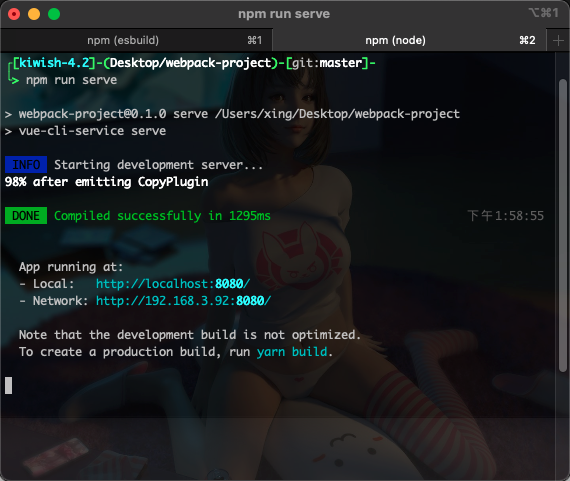
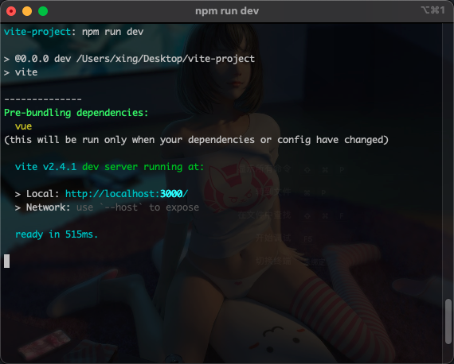
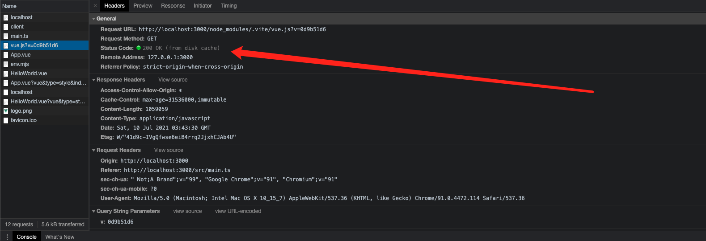
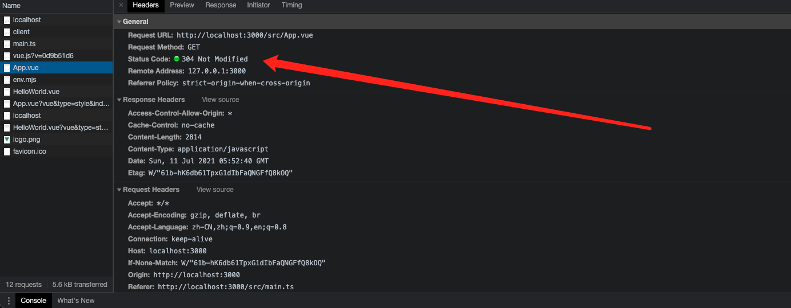

# vite 与 webapck 的对比

## webpack

<image src="./src/assets/webpack.png">

-   入口文件识别
-   递归逐级识别项目依赖，构建依赖图谱
-   将代码转成 `AST` 抽象语法树，在`AST`阶段中去处理代码
-   把 `AST` 抽象语法树变成可以被浏览器执行的代码，然后进行输出

### 缺点

1. 随着项目的增长，编译时间长
2. 开发服务器启动缓慢（每次启动都需要将整个项目编译后在启动服务器）
3. 热更新缓慢

## vite

<image src="./src/assets/vite.png">

-   当声明一个 `script` 标签类型为 `module` 时，浏览器就会像服务器发起一个 GET
-   `vite` 通过劫持浏览器的这些请求，并在后端进行相应的处理，将项目中使用的文件通过简单的分解与整合，然后再返回给浏览器。
-   `vite`整个过程中没有对文件进行打包编译，所以其运行速度比 `webpack` 开发编译速度快出许多。
-   使用 `esbuild` 预构建依赖
-   利用 `HTTP` 头来加速页面加载：依赖模块采用强缓存，源码模块使用协商缓存
-   真正的按需编译
-   即时的热模块替换(HMR)

### 缺点

1. 只能针对现代浏览器（ES2015+）
2. 与 CommonJS 模块不完全兼容

## 构建依赖的区别

### webpack

底层使用 `node.js` 写的打包器预构建依赖，没有使用 `esbuild` 快。

### vite

使用 `esbuild` 预构建依赖。`esbuild` 使用 `Go` 编写，并且比以 `Node.js` 编写的打包器预构建依赖快 10-100 倍。

## HMR（热替换）的区别

### webpack

热更新效率低下，即使是 `HMR` 更新速度也会随着应用规模的增长而显著下降。

### vite

`HMR`是在`EMS`的基础上实现的,利用 `HTTP` 头来加速页面加载：

-   依赖模块采用强缓存 (Cache-Control: max-age=31536000,immutable)
    

-   源码模块使用协商缓存 (304 Not Modified)
    

## 生产构建

`vite` 提供了一套生产构建指令，可预配置，使用 `rollup` 打包代码，至于为什么没有使用 `esbuild` 打包，官方说明，`Rollup` 在应用打包方面更加成熟和灵活, 但不排除 `esbuild` 生态成熟后使用它。

## 为何需要预编译

1. `CommonJS` 和 `UMD` 兼容性: 开发阶段中，`Vite` 的开发服务器将所有代码视为原生 `ES` 模块。因此，`Vite` 必须先将作为 `CommonJS` 或 `UMD` 发布的依赖项转换为 `ESM`。
2. 性能： `Vite` 将有许多内部模块的 `ESM` 依赖关系转换为单个模块，以提高后续页面加载性能。

比如我们项目中需要使用 `lodash-es` , 如果没有依赖预编译的话， 浏览器会发送很多的请求, 使用依赖预编译后， 请求只会有一个

## 为什么生产仍然需要打包

尽管原生 ESM 现在得到了广泛支持，但由于嵌套导入会导致额外的网络往返，在生产环境中发布未打包的 ESM 仍然效率低下（即使使用 HTTP/2）。为了在生产环境中获得最佳的加载性能，最好还是将代码进行 tree-shaking、懒加载和 chunk 分割（以获得更好的缓存）。

## 跟 vite 同时期出现的现代化构建工具

-   [snowpack](https://www.snowpack.dev/)
-   [WMR](https://github.com/preactjs/wmr)
-   [@web/dev-server](https://modern-web.dev/docs/dev-server/overview/)

## 兼容性

在 `vite 1.x` 的版本中， 它并不支持旧版本的浏览器的， 但是在 `vite@^2.0.0` 后 官方提供了一个插件， 可以兼容旧版本的浏览器： [@vitejs/plugin-legacy](https://github.com/vitejs/vite/tree/main/packages/plugin-legacy)

### 使用

    import { defineConfig } from 'vite'
    import vue from '@vitejs/plugin-vue'
    import legacy from '@vitejs/plugin-legacy'

    // https://vitejs.dev/config/
    export default defineConfig({
        plugins: [
            vue(),
            legacy({
                // not IE 11
                // targets: ['defaults', 'not IE 11']

                // 如果是 IE 11 ，还需要 regenerator-runtime
                targets: ['ie >= 11'],
                additionalLegacyPolyfills: ['regenerator-runtime/runtime']
            })
        ]
    })

使用插件后，会打包出两套代码，一套面向新式浏览器，另一套则包含各类 polyfill 和语法兼容来面向老式浏览器，同时在 html 中插入根据浏览器 ESM 支持来选择性加载对应包的代码。

## jsx

    // 安装
    npm install @vitejs/plugin-vue-jsx -D

    // 配置 : 在 vite.config.ts 文件中挂载
    import vueJsx from '@vitejs/plugin-vue-jsx'
        export default defineConfig({
        plugins: [ vueJsx()]
    })

    // tsconfig.json 文件中
    {
        // include 需要包含tsx
        "include": [
            "src/*",
            "src/**/*.jsx",
            "src/**/*.ts",
            "src/**/*.js",
            "src/**/*.d.ts",
            "src/**/*.tsx",
            "src/**/*.vue",
        ],
        "compilerOptions": {
            // 在.tsx文件里支持JSX
            "jsx": "preserve",
        }
    }

    // 使用

    import { withModifiers, defineComponent } from 'vue'
    import HelloWorld from './components/HelloWorld.vue'
    import '@/App.css'
    import Logo from './assets/logo.png'

    const App = defineComponent({
        setup() {
            return () => (
                <>
                    
                    <HelloWorld msg="Hello Vue 3 + TypeScript + Vite" />
                </>
            )
        }
    })

    export default App

更多 `jsx` 语法可以查看 https://github.com/vuejs/jsx-next/blob/dev/packages/babel-plugin-jsx/README-zh_CN.md

## Element-plus

### 国际化问题

按照文档，如果是通过 `es modules` 按需引入 `Element Plus` ， 配置国际化在测试环境下是没有问题的， 但是在生产环境下，会报错，原因是 `locale` 不是一个函数，要调用 `use` 方法才行， 最终修改如下：

    // element-plus bug
    import.meta.env.DEV ? locale(lang) : locale.use(lang)

`import.meta.env.DEV` 这是 `vite` 提供的环境变量, 它的值由 `vite.config.ts` 中的 `mode` 决定
